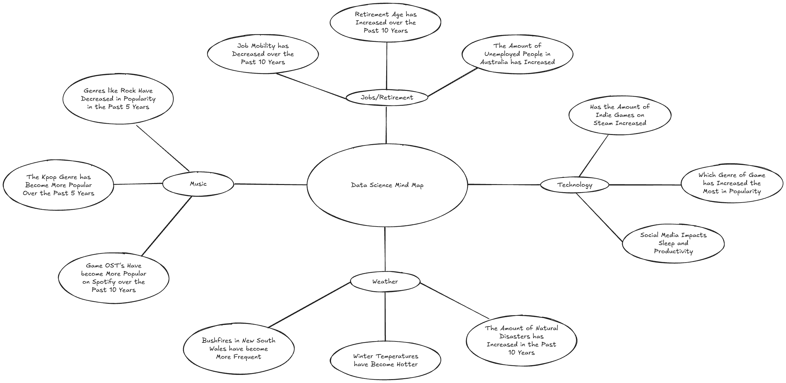

# CT1A - Task 1

## Identifying and Defining
### Mind Map

### Define Your Purpose
Social media affects people's sleep, stress and productivity.

### Functional Requirements
The program will be able to load csv files, it will be unable to load incorrect file types however. 
The program will need to sort and group data, and work with missing values.
Statistical analysis that the program will need to do includes, mean, median, mode and range. This will allow the user to compare with the different statistics.
The data will need to be visualised using Matplotlib line graphs. (Social media hours vs productivity, stress, etc.)
The system should output graphs and tables. The final dataset should be stored in a .csv file.

### Non-Functional Requirements
The user interface should be easy to navigate and understand, allowing users to understand what they are looking for. The README document should describe how the program is to be used. The system will be tested to ensure that the system will not have errors.

### Use-Case
Actor: User

Goal: To be able to access and interact with data using the program's user interface

Preconditions:
- The dataset is already loaded by the administrator
- The user is able to see and interact with the interface

Main Flow:
1. The user is greeted with the UI
2. The user then selects one of the given options:

    - Sort data and find averages
    - View graphs of certain aspects of the user's choice
    - Change certain values
    - Exit to the first menu
3. The system performs the actions requested by the user

Postconditions:
- User has interacted with the data
- Updates are saved
- Data remains available for future use

## Researching and Planning

### Research Your Chosen Issue
- [Sleep and Social Media](https://www.sleepfoundation.org/how-sleep-works/sleep-and-social-media)
- [Impact of Social Media on Work Efficiency](https://pmc.ncbi.nlm.nih.gov/articles/PMC8355543/)
- [Social Media and Mental Health](https://www.helpguide.org/mental-health/wellbeing/social-media-and-mental-health)

### Discuss Your Findings
Social media can provide both positive and negative impacts on health. Social media positively benefits us as it allows us to interact with friends, family and work colleagues. However, excessive social media can result with, lack of sleep, depression, high stress and isolation. An example of a positive feature of social media includes the usage of WeChat in China, as it is widely used by Chinese companies, highly benefiting the efficiency of work. A negative example however, is FOMO or fear of missing out. This is relevant to social media as for example, sites like Facebook or Instagram create feelings that other people are living life better than you are. This triggers anxiety and could impact self-esteem. Social media can be both good and bad for health, however, it should be used in moderation, to avoid effects like fear of missing out.

### Acquire Your Data
[Dataset from Kaggle](https://www.kaggle.com/datasets/jayjoshi37/social-media-usage-vs-sleep-stress-and-productivity/data)

### Data Dictionary
|Field|Datatype|Formart for Display|Description|Example|Validation|
| ----------- | ----------- | ----------- | ----------- | ----------- | ----------- |
| user_id | integer | N | The serveyed user's number | 43 | Can be any number, must be numbers only |
| age | integer | N | The serveyed user's age | 23 | Must not contain letters |
| daily_screen_time | float64 | N.NN | The daily screen time of the user in hours | 2.39 | Must contain only numbers and be 2 decimal places |
| social_media_hours | float64 | N.NN | The amount of screen time on social media apps in hours | 1.39 | Must be only numbers and be 2 decimal places |
| sleep_hours | float64 | N.NN | The amount of sleep the user got in hours | 8.46 | Only a number with 2 decimal places |
| exercise_minutes | integer | N | The amount of time the user spent exercising in minutes | 61 | Only numbers, must not contain decimals|
| study_work_hours | float64 | N.NN | The amount of time the user spent studying or working in hours | 3.73 | Only numbers, to two decimal places |
| productivity_score | float64 | N.NN | A score out of 100 of the user's productivity | 33.86 | Must be 100 or lower and have 2 decimal places |
| stress_level | object | XX...XX | How stressed the user is from low, medium and high | Low | Must not contain numbers, can only be low, medium and high |
| platform | object | XX...XX | The social media platform that the user used the most | Youtube | Must contain only letters and should be a social media platform name |